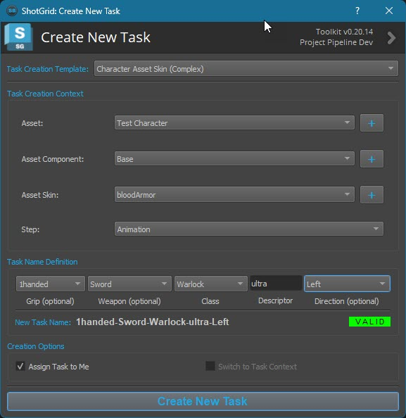
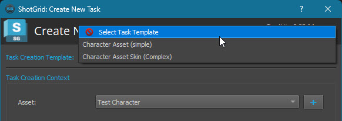
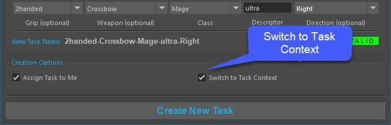
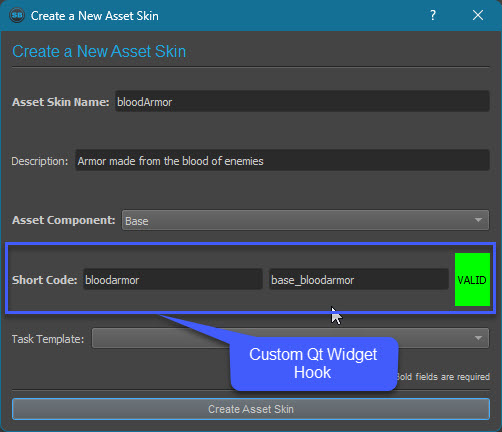
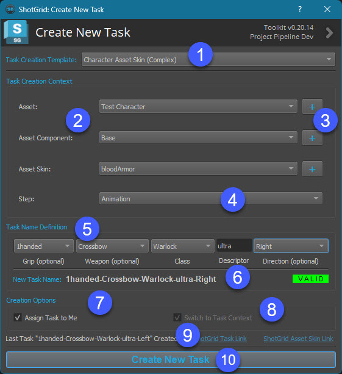
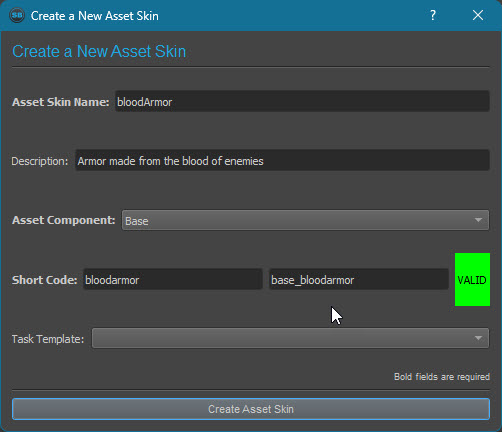
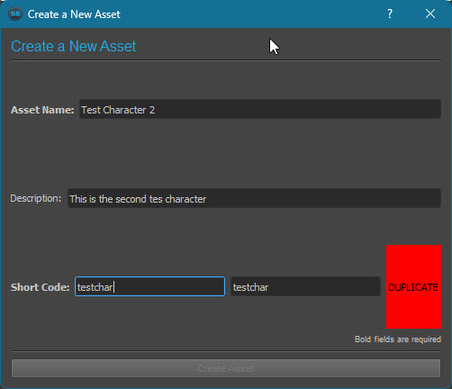
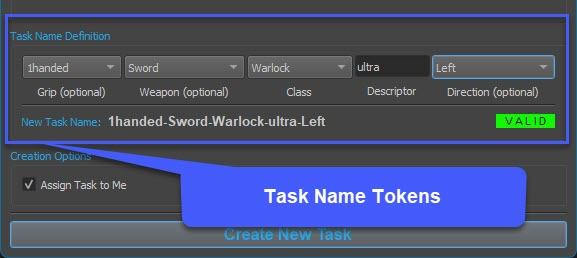
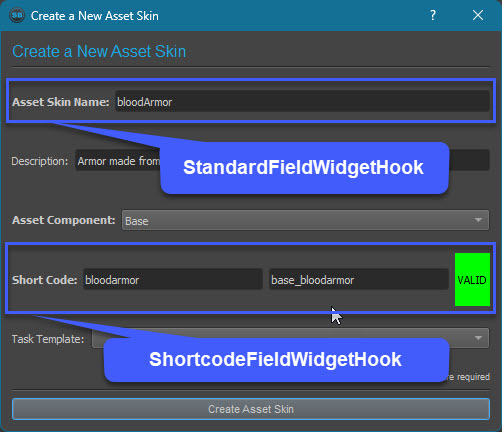

# Welcome to the Task Creator Toolkit App

The Task Creator Toolkit app allows Artists and Production staff to easily create Tasks in ShotGrid.

The app is completely configurable and allows for precise control over how the Tasks are named and created.

This app runs in both ShotGrid Desktop and in DCCs allowing artists and production staff to create ShotGrid Tasks at will. 
The app `sb-multi-taskcreator.yml` file allows the app to be configured for the particular naming convention standard needs of the project:

- Define multiple custom Task Creation Templates (per entity)
- Template task name entity definitions can be filtered & ordered using typical ShotGrid API syntax
- Support for different SG field types including Text, List, Entity & Regex when defining Task names
- Define part of the Task name from other Entity values (dropdown menu)
- Allow some components of the Task name to be optional
- Enforce making Task names unique and disallow the creation of Tasks that are not unique
- Allows for new entities (ie: Asset, Shot) to be created directly in the app, before the Task is created
- When creating new entities, field names can be enforced using different configurable widgets through Toolkit hooks

I would love to hear feedback about this app, any feature requests or bugs you might encounter. Feel free to email me directly or leave a message on Github.

#### Cheers,
#### Scott Ballard
* scott@scottballard.net
* https://www.linkedin.com/in/scottballard

***
## Features

The app can run either in standalone mode directly from ShotGrid Desktop or it can be integrated and launched from your favorite DCC, like Maya or Nuke. Tasks created directly inside of a DDC can be switched to automatically (Toolkit context change) , allowing the Artist to start working on the Task immediately.

One of the difficulties with allowing Artists or the Production team the ability to create Tasks is making sure that certain naming conventions are followed and the required fields are completed. The Task Creator app offers a flexible approach to enforcing standards that are particular to your project.

### Templates
The app allows for different `Task Creation Templates` to be defined. Many templates can be defined per entity and allow for different configurations.

### Task Context
When the app is launched inside a DCC (ie: Maya, Nuke) the "Switch to Task Context" checkbox will be automatically enabled, allowing Artists to switch the Toolkit context to the new Task they just created.

### Hooks
The app supports writing your own custom hooks and Qt widgets that interface with creating new entities. 

***
## Using the App

1. The user selects the Task Creation Template from the dropdown menu
2. The UI dynamically updates with the required entities to link the Task to. The user then selects the entities to link to
3. Optionally, the user can create a new entity that will then appear in the dropdown menu (see below)
4. The user selects the Step (dept) to link the Task to
5. The user selects & completes the required & optional Task name tokens
6. Based on the users selection & input the Task name will be checked to see if it exists already. If its a duplicate, then the Task cannot be created
7. Optionally, the new Task can be assigned to the user (default)
8. If the app is running in a DCC (TK engine) then the current Toolkit context can be switched to the new Task
9. Once a Task is created it is listed along with links to open it in ShotGrid
10. Once all field are completed properly and a valid Task name is defined then the Task can be created.

`The UI will stay open allowing for more Tasks to be created`

### Creating New Entities
The app offers the ability for the Artist to create new entities in ShotGrid, like Assets or Shots.

Example of the Shortcode valid defined already existing in ShotGrid, requiring the user to change the shortcode to something else 

***
## Installation
If you want to get up and running quickly, follow this simple step:
* tank install_app Project tk-desktop https://github.com/scottb08/sb-multi-taskcreator

### Manual Installation
The app contains a folder called `setup` which contains a sample `sb-multi-taskcreator.yml` file which contains app settings. 
Drop this into your Toolkit `config\env\includes\settings` folder, then add the app to SG Desktop and/or DCCs.

***
## Configuration

The `sb-multi-taskcreator.yml` file in the `setup` folder shows two example Task Creation Templates, a simple template and a complex template.

Note: The complex example includes CustomEntities which most likely won't exist in your ShotGrid site. Update the configuration to match your particular ShotGrid site.

### Task Name Token Definition
Task names can be a simple single text value or compromised of many different Task name tokens strung together seperated by a delineator (ex: "-")

##### Task Name Token Types

- Entity
  - The Task token can be defined using a ShotGrid query to look up another entity. Standard filter, order, limit & complex filter syntax is supported in the configuration
  - The results of the query will be displayed to the user in a dropdown menu
- Regex
  - A standard regex definition can be used to define how the user names the Task token and what characters they are allowed to enter
- List
  - A list of values can be supplied which will be displayed in a dropdown menu
  - Use the `items: - itemA - item B` entry in the configuration

Any of the tokens above can be made optional by including the `required: False` value in the config

The global delineator `task_name_delineator` value can be locally overridden for any given Task token by including the `delineator: <value>` entry with the value you want. See the configuration for an example.

### New Entity Creation
The following describes working with the new entity dialog window

### Hooks

The following Hooks come standard with the app. Hooks that provide different functionality can be written and used alongside these Hooks.

###### StandardFieldWidgetHook

This hooks provides support for either a QLineEdit widget (with Regex support) or QComboBox widget that contains ShotGrid Entity field values based on a ShotGrid API query.

###### ShortcodeFieldWidgetHook

This hook provides support for `shortcodes` which are often used to represent a shorter version of the full entity name and usually require special naming conventions and checking for duplicate names. The shortcode widget comprises of two widgets, the first the user enters the desired name and the second shows the filtered, sanitary name.

